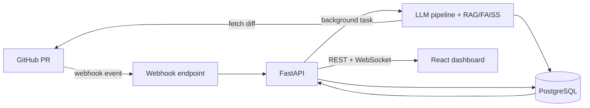

# AI Code Review Assistant

Reviewing every pull request by hand is slow and inconsistent, and small teams
rarely have the bandwidth to do it well. This app automatically reviews GitHub
PRs: when a PR opens, it pulls the diff, runs it through an LLM grounded in your
team's own coding style guides (via retrieval), and posts structured comments
(file, line, severity) to a dashboard with live status updates — so code gets
consistent, context-aware feedback in seconds instead of days.

## Architecture



GitHub → Webhook → FastAPI → LLM Pipeline → PostgreSQL → React.

## Setup

```bash
git clone <repo-url>
cd ai-code-review
cp .env.example .env      # then fill in OPENAI_API_KEY, JWT_SECRET, etc.
docker compose up --build
```

- Client: http://localhost:5173
- API + docs: http://localhost:8000 (`/docs`)
- Postgres: localhost:5432

Apply migrations once the stack is up:

```bash
docker compose exec server alembic upgrade head
```

## How it works (the RAG pipeline)

When a pull request opens, GitHub sends a webhook. FastAPI verifies the
signature, saves a `pending` review, and returns `200` immediately while the
real work runs in the background:

1. **Fetch** the PR's diff from the GitHub API.
2. **Chunk** the diff by file into token-bounded pieces.
3. **Retrieve** — your coding style guides (markdown in `server/docs`) are
   pre-embedded into a local **FAISS** vector index. For each diff chunk, the
   most relevant style-guide passages are pulled in by semantic similarity.
4. **Review** — each chunk plus its retrieved guidelines is sent to the LLM,
   which returns structured findings: `{ file, line, severity, comment }`.
5. **Store & notify** — comments are saved to PostgreSQL, the review is marked
   `complete`, and connected clients get a live update over a WebSocket.

Grounding the model in your own guidelines (Retrieval-Augmented Generation) is
what keeps the feedback consistent with how *your* team writes code, instead of
generic advice.

## Tech stack

| Layer | Technology |
|-------|------------|
| Frontend | React + TypeScript (Vite, Tailwind CSS) |
| Backend | FastAPI (Python) |
| Database | PostgreSQL (SQLAlchemy + Alembic) |
| Vector search | FAISS |
| LLM | OpenAI API (chat + embeddings) |
| Auth | JWT (bcrypt-hashed passwords) |
| Infra | Docker / docker-compose |

## Running without Docker

```bash
# Backend
cd server && python -m venv .venv && source .venv/bin/activate
pip install -r requirements.txt
alembic upgrade head && uvicorn app.main:app --reload

# Frontend
cd client && npm install && npm run dev
```
